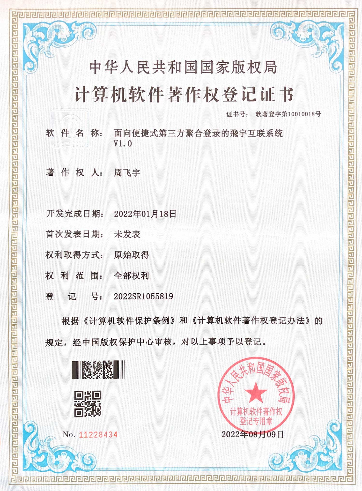
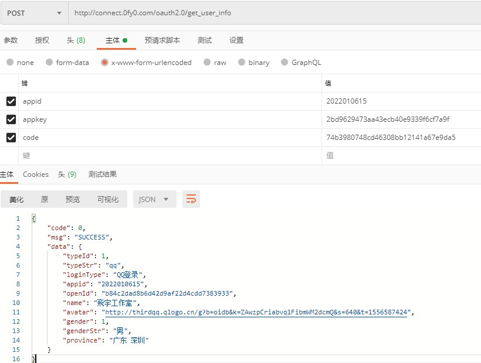

# 飛宇互联


> 面向便捷式第三方聚合授权登录，支持第三方授权登录：支付宝、QQ、微博、百度、微信
>
> 开发文档:https://finnfy.github.io/fyconnect/
>
> 申请平台:http://connect.yi6.cc


开发文档:https://finnfy.github.io/fyconnect/

申请平台:http://connect.yi6.cc





## 一、本地开发环境试用

- 飛宇互联应用的appid

> 2022010615

- 飛宇互联应用密钥appkey

> 2bd9629473aa43ecb40e9339f6cf7a9f

- 成功回调地址

> http://localhost:8080/fylogin.action

```
飛宇互联应用的appid:2022010615
飛宇互联应用密钥appkey:2bd9629473aa43ecb40e9339f6cf7a9f
成功回调地址:http://localhost:8080/fylogin.action
```


### **1.1 授权登录示例**

- QQ登录

>http://connect.0fy0.com/oauth2.0/authorize?appid=2022010615&redirect_uri=http%3A%2F%2Flocalhost%3A8080%2Ffylogin.action&type=qq

```
http://connect.0fy0.com/oauth2.0/authorize?appid=2022010615&redirect_uri=http%3A%2F%2Flocalhost%3A8080%2Ffylogin.action&type=qq
```


- 支付宝登录

>http://connect.0fy0.com/oauth2.0/authorize?appid=2022010615&redirect_uri=http%3A%2F%2Flocalhost%3A8080%2Ffylogin.action&type=alipay

```
http://connect.0fy0.com/oauth2.0/authorize?appid=2022010615&redirect_uri=http%3A%2F%2Flocalhost%3A8080%2Ffylogin.action&type=alipay
```


- 新浪微博登录

> http://connect.0fy0.com/oauth2.0/authorize?appid=2022010615&redirect_uri=http%3A%2F%2Flocalhost%3A8080%2Ffylogin.action&type=sina

```
http://connect.0fy0.com/oauth2.0/authorize?appid=2022010615&redirect_uri=http%3A%2F%2Flocalhost%3A8080%2Ffylogin.action&type=sina
```


- 百度登录

> http://connect.0fy0.com/oauth2.0/authorize?appid=2022010615&redirect_uri=http%3A%2F%2Flocalhost%3A8080%2Ffylogin.action&type=baidu

```
http://connect.0fy0.com/oauth2.0/authorize?appid=2022010615&redirect_uri=http%3A%2F%2Flocalhost%3A8080%2Ffylogin.action&type=baidu
```


- 微信登录

> http://connect.0fy0.com/oauth2.0/authorize?appid=2022010615&redirect_uri=http%3A%2F%2Flocalhost%3A8080%2Ffylogin.action&type=weixin

```
http://connect.0fy0.com/oauth2.0/authorize?appid=2022010615&redirect_uri=http%3A%2F%2Flocalhost%3A8080%2Ffylogin.action&type=weixin
```


### 1.2 获取用户信息




```
http://connect.0fy0.com/oauth2.0/get_user_info?appid=2022010615&appkey=2bd9629473aa43ecb40e9339f6cf7a9f&code=AZF************************Y1FG
```

**返回信息**

```json
{
    "code": 0,
    "msg": "SUCCESS",
    "data": {
        "typeId": 1,
        "typeStr": "qq",
        "loginType": "QQ登录",
        "appid": "2022010615",
        "openId": "b84c2dad8b6d42d9af22d4cdd7383933",
        "name": "飛宇工作室",
        "avatar": "http://thirdqq.qlogo.cn/g?b=oidb&k=ZAwzpCriabvq1FibmWM2dcmQ&s=640&t=1556587424",
        "gender": 1,
        "genderStr": "男",
        "province": "广东 深圳"
    }
}
```


## 二、授权登录

**请求地址**：

http://connect.0fy0.com/oauth2.0/authorize

https://connect.0fy0.com/oauth2.0/authorize

**请求方法**：
GET

**请求参数**：
请求参数请包含如下内容：


|     参数      | 是否必须 |                             含义                             |
| :-----------: | :------: | :----------------------------------------------------------: |
| appid |   必须   |                 飛宇互联应用的appid                 |
|   redirect_uri   |   必须   |            成功授权后的回调地址，必须是注册appid时填写的主域名下的地址,可带参数.注意需要将url进行URLEncode            |
| type  |   必须   | 登录方式。"qq"或"alipay"或"sina"或"baidu"或"weixin" |
| other | 选填 | 用于第三方应用携带其他状态值，成功授权后回调时会原样带回 |


### **2.1 type 参数说明**

**登录方式**

|  type  |     描述     |
| :----: | :----------: |
|   qq   |    QQ登录    |
| alipay |  支付宝登录  |
|  sina  | 新浪微博登录 |
| baidu  |   百度登录   |
| weixin |   微信登录   |


**返回说明：**

如果用户成功登录并授权，则会跳转到指定的回调地址，并在redirect_uri地址后带上Authorization Code和自己自定义参数。如：

```
https://0fy0.com/return.php?code=AZF************************Y1FG&other=1
```


### **2.2 示例**


#### **2.2.1 不带参数**

> http://connect.0fy0.com/oauth2.0/authorize?appid=2022201018&redirect_uri=https://0fy0.com/return.php&type=qq
>
> http://connect.0fy0.com/oauth2.0/authorize?appid=2022201018&redirect_uri=https://0fy0.com/return.php&type=alipay
>
> http://connect.0fy0.com/oauth2.0/authorize?appid=2022201018&redirect_uri=https://0fy0.com/return.php&type=sina
>
> http://connect.0fy0.com/oauth2.0/authorize?appid=2022201018&redirect_uri=https://0fy0.com/return.php&type=baidu
>
> http://connect.0fy0.com/oauth2.0/authorize?appid=2022201018&redirect_uri=https://0fy0.com/return.php&type=weixin


####  **2.2.2 带参数**

```js
// 带参数形式1-QQ
http://connect.0fy0.com/oauth2.0/authorize?appid=2022010615&redirect_uri=http%3A%2F%2Flocalhost%3A8080%2Ffylogin.action%3Fflag%3D1&type=qq

// 带参数形式2-QQ
http://connect.0fy0.com/oauth2.0/authorize?appid=2022201018&redirect_uri=https%3A%2F%2F0fy0.com%2Freturn.php&other=1&type=qq

// 其余以此内推
```


## 三、获取用户信息
**请求地址**：

http://connect.0fy0.com/oauth2.0/get_user_info

https://connect.0fy0.com/oauth2.0/get_user_info

**请求方法**：
GET/POST

**请求参数**：
请求参数请包含如下内容：


|     参数      | 是否必须 |                             含义                             |
| :-----------: | :------: | :----------------------------------------------------------: |
| appid |   必须   |                 飛宇互联应用的appid                 |
|   appkey   |   必须   |      飛宇互联应用密钥appkey       |
| code  |   必须   | code作为换取用户信息的票据，每次用户授权带上的code将不一样，code只能使用一次，10分钟未被使用自动过期。 |


**返回信息:**

- 已QQ为例

```json
{
    "code": 0,
    "msg": "SUCCESS",
    "data": {
        "typeId": 1,
        "typeStr": "qq",
        "loginType": "QQ登录",
        "appid": "2022010615",
        "openId": "b84c2dad8b6d42d9af22d4cdd7383933",
        "name": "飛宇工作室",
        "avatar": "http://thirdqq.qlogo.cn/g?b=oidb&k=ZAwzpCriabvq1FibmWM2dcmQ&s=640&t=1556587424",
        "gender": 1,
        "genderStr": "男",
        "province": "广东 深圳"
    }
}
```


### 3.1 返回参数说明

| 参数说明 |       描述        |
| :------: | :---------------: |
|   code   | 返回码;0:返回成功 |
|   msg    |     返回信息      |
|   data   |  返回结果(数据)   |

#### 3.1.1 data结果说明

| 参数说明  |  类型  |             描述             |
| :-------: | :----: | :--------------------------: |
|  typeId   |  int   |         互联登录方式         |
|  typeStr  | String |         互联登录方式         |
| loginType | String |       互联登录方式中文       |
|   appid   | String |          应用appid           |
|  openId   | String |      飛宇互联用户唯一id      |
|   name    | String |      第三方互联用户昵称      |
|  avatar   | String |           用户头像           |
|  gender   |  int   |     用户性别(1:男,0:女)      |
| genderStr | String |           用户性别           |
| province  | String | 城市(百度登录为用户登录城市) |


**注：**

由于支付宝/微信登录在2022年开始不在提供性别及城市，所以性别默认返回男（1），城市返回登录城市。


## 四、公共返回码说明

**公共返回码**

| 错误码 |       含义说明       |
| :----: | :------------------: |
|   0    |         成功         |
|  1001  |         失败         |
|  1002  |       系统错误       |
|  1003  |   Token错误或失效    |
|  1004  |      应用不存在      |
|  1005  | 应用正在审核或未通过 |
|  1006  |  缺少参数或参数错误  |
|  1007  |   redirect_uri错误   |
|  1008  |   app_key密钥错误    |
|  1009  |   code错误或已失效   |
|  1010  |     应用不属于你     |


**微信扫码登录错误码**

| 错误码 |             含义说明             |
| :----: | :------------------------------: |
|   0    |             登录成功             |
|   9    |          二维码获取成功          |
|   10   |             扫码成功             |
|   11   | 已失效，请刷新页面重新获取二维码 |
|  101   |               错误               |


## 五、图标使用


```css
.qq,.alipay,.sina,.baidu,.weixin{
    width: 20px;
    height: 20px;
    display: block;
    overflow: hidden;
    background: url(https://image.0fy0.com/static/user/finn/connect/other-login.png) no-repeat;
}
.qq{
    background-position: 0px 0px;
}
.alipay{
    background-position: -20px 0px;
}
.sina{
    background-position: -40px 0px;
}
.baidu{
    background-position: -60px 0px;
}
.weixin{
    background-position: -80px 0px;
}
```


**入驻平台**

- http://connect.yi6.cc


需要的请发送邮箱fy@0fy0.com